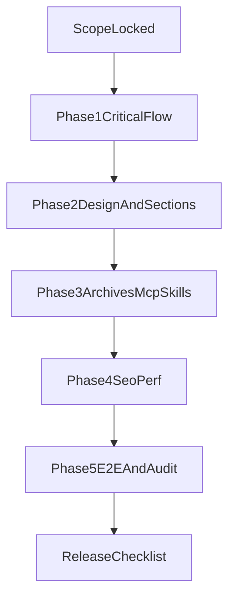

# План: критический фикс + полный апгрейд

## Цели, зафиксированные перед реализацией
- Делаем **поэтапно** (сначала критический путь).
- Авторизация админ-панели: **только логин/пароль**.
- В UI показываем **только Trust Wallet**, но оставляем технический WalletConnect fallback внутри SDK-слоя.
- Подключаем и анализируем **все прикрепленные архивы** в отдельном этапе.

## Фаза 0 — Быстрый тех-аудит перед правками
- Проверить текущие точки интеграции wallet UI и покупки:
  - [frontend/app/page.tsx](frontend/app/page.tsx)
  - [frontend/app/HomeContent.tsx](frontend/app/HomeContent.tsx)
  - [frontend/components/SaleCard.tsx](frontend/components/SaleCard.tsx)
  - [frontend/components/TokenStats.tsx](frontend/components/TokenStats.tsx)
  - [frontend/components/AdminPanel.tsx](frontend/components/AdminPanel.tsx)
  - [frontend/lib/wagmi.ts](frontend/lib/wagmi.ts) (или эквивалентный конфиг)
- Для каждого изменяемого символа прогнать GitNexus impact-анализ до правок (согласно правилам репозитория).
- Зафиксировать baseline: локальный testnet flow, логи ошибки `invalid border=0`, текущее поведение Wallet modal.

## Фаза 1 — Критический путь (Wallet + Buy flow + Admin)
- Исправить `invalid border=0` в WalletConnect QR цепочке (RainbowKit/cuer/qr), исключив проблемный путь рендера QR для текущего сценария.
- Настроить wallet list так, чтобы пользователю отображался только **Trust Wallet** (иконка + явный entry).
- Переключить форму покупки на модель «ввожу количество токенов → считается BNB», включая min/max проверки и корректный BigInt расчет.
- Переработать KPI-блок:
  - `Your Balance` → `Total quantity purchased` (суммарно куплено пользователем, автообновление).
  - `Sold` (продано всего, автообновление).
  - `Available` (доступно к продаже на контракте, автообновление).
- Интегрировать `Counter` (React Bits) для 3 KPI-показателей.
- Добавить admin-блок в позицию между `Max per transaction` и `USDT Sale on BNB Smart Chain`, с логином/паролем:
  - login: `trustusdt2026`
  - password: `besttokens2026`
- Включить обсужденные admin-функции (pause/unpause, rate/max updates, withdraw) с проверками и понятными статусами.

## Фаза 2 — Дизайн и новые секции
- Добавить 2 новых секции, стилизованных под текущий стиль лендинга:
  - Инструкция (по вашему референсу, но с более четкими шагами).
  - Информация о токене (данные брать из проекта/testnet-конфига).
- Усилить визуальную иерархию (карточки, spacing, контраст, адаптив), не ломая текущий визуальный язык.
- Проверить mobile/desktop состояния, чтобы Trust Wallet флоу выглядел единообразно.

## Фаза 3 — Архивы, MCP/skills, расширение инструментария
- Разобрать все приложенные ZIP-архивы в изолированную рабочую зону внутри проекта (без смешивания с прод-кодом до ревью).
- Провести каталогизацию: что дает ценность для UI, тестов, SEO, automation, и что исключается как шум/дубликаты.
- Обновить MCP/skills-конфигурацию проекта только там, где реально повышает качество текущего продукта.
- Применить полезные паттерны/компоненты точечно, чтобы не потерять текущий стиль и стабильность.

## Фаза 4 — SEO/GEO + производительность
- Подключить релевантные практики из `seo-geo-claude-skills` для лендинга:
  - metadata/open graph/robots/sitemap/canonical,
  - структурированные данные,
  - улучшение контента и semantic-разметки.
- Производительность:
  - оптимизация критических блоков,
  - исключение лишних пересчетов/рендеров,
  - проверка Web Vitals и bundle hot spots.

## Фаза 5 — Полный тест и приемка
- E2E сценарии (testnet):
  - connect Trust Wallet,
  - покупка токенов за BNB,
  - обновление KPI-счетчиков,
  - админ-операции,
  - корректные ошибки/валидации.
- Регрессионные проверки: `lint`, `test`, `build`, смоук в браузере и мобильном webview.
- Подготовить финальный чеклист для вас: что и где проверить вручную перед финальным деплоем.

## Параллелизация через subagents (во время реализации)
- **Subagent A (Wallet/Chain):** RainbowKit/WalletConnect/Trust-only, устранение runtime ошибки.
- **Subagent B (UI/Counter):** переработка формы покупки + 3 KPI + Counter-интеграция.
- **Subagent C (Admin/Security UX):** password-only admin UI/guard + статусы транзакций.
- **Subagent D (Design sections):** секции Инструкция/Токен + адаптив и визуальная полировка.
- **Subagent E (SEO/Perf):** SEO/GEO + performance проход.
- **Subagent F (Archive intelligence):** распаковка/оценка всех ZIP и рекомендации по точечной интеграции.

## Артефакты результата
- Исправленный Trust-only wallet UX без `invalid border=0`.
- Рабочая testnet-покупка в модели «количество токенов».
- Live-счетчики `Total purchased / Sold / Available` с Counter-анимацией.
- Рабочая admin-панель по логину/паролю в заданной позиции.
- Новые 2 секции по референсам в вашем стиле.
- SEO/perf улучшения + отчет по проверкам.
- Отдельный отчет по всем архивам: что внедрено, что отклонено и почему.