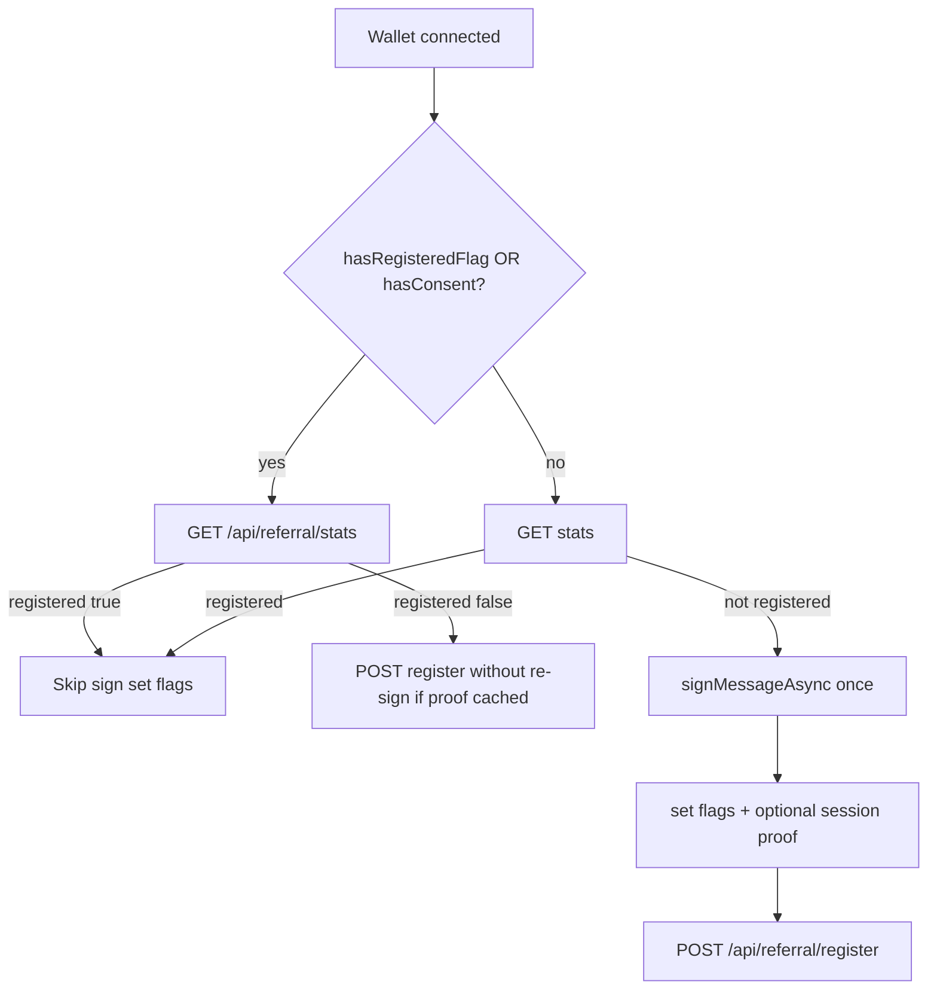

# USDT Sale Phase 2 — Hero, Header, Referral, Flags, SEO/Deploy

## Контекст и решения (из ваших ответов)

| Тема | Выбор |
|------|--------|
| Hero video | Копия из Downloads + оптимизация где возможно |
| Флаги | en→US, pt→BR, ar→SA, остальные по стране |
| Анимация флагов | Лёгкий CSS wave + `prefers-reduced-motion` |
| SEO keywords | Полный набор (flash, fake, trust wallet, phantom, BEP-20, BSC, BNB, tokens, coins) |
| Деплой | Production Vercel (`flash-tokens-trust-mainnet-20260528.vercel.app`) |
| Коммиты | 5 тематических |
| Инструменты | GitNexus+diagnose (referral), Firecrawl→bundle (flags), @seo-geo pack, full deploy pipeline, Playwright CLI |

---

## 1. Hero video (задача 1)

**Файлы:** [`frontend/components/Hero.tsx`](frontend/components/Hero.tsx), `frontend/public/hero-loop.mp4`

**Действия:**
- Скопировать `C:\Users\Asus\Downloads\document_6118323269843034499 (1).mp4` → `frontend/public/hero-loop.mp4` (замена текущего promo-копия).
- Попытка оптимизации: проверить наличие `ffmpeg`; если есть — `-an -movflags +faststart -crf 28` для меньшего размера и быстрого старта; если нет — оставить as-is с `preload="metadata"`, `muted`, `playsInline`, `loop`.
- Опционально: статичный `poster` (первый кадр) в `public/hero-poster.webp` для LCP.
- Playwright audit уже проверяет `video source[src="/hero-loop.mp4"]` — должно пройти без изменений скрипта.

**UI (@21st-design):** при необходимости — только тонкая полировка контейнера video (border/radius), без изменения desktop grid.

---

## 2. Mobile header only (задача 2)

**Файл:** [`frontend/components/Header.tsx`](frontend/components/Header.tsx) — **только `max-md:` / `md:` breakpoints, desktop layout не менять.**

**Проблема (скрин):** одна flex-строка: menu + logo + «USDT Sale» + PAUSED слева; справа LocaleSwitcher (полный «Русский») + address + buttons → overlap.

**Целевой mobile layout (≤767px):**

```text
Row 1: [≡ menu] [logo] USDT Sale [PAUSED?]     …flex-1…
Row 2:                    [flag+locale] [address] [disconnect icon/text]
```

**Реализация:**
- Обернуть header inner в `max-md:grid max-md:grid-cols-[1fr_auto] max-md:gap-y-2 md:flex md:items-center md:justify-between`.
- Левая группа: `min-w-0`, title `truncate max-md:text-base max-md:max-w-[8rem]`.
- LocaleSwitcher: на mobile компактная кнопка (флаг + код `ru`, без длинного label) — см. п.4.
- Wallet: `max-md:px-2 max-md:text-xs`, кнопка «Отключить» → icon-only или короткий label на `max-md`.
- `gap`/`py` уменьшить на mobile: `max-md:py-2 max-md:px-3`.

**Проверка:** Playwright mobile viewport в [`frontend/scripts/playwright-production-audit.mjs`](frontend/scripts/playwright-production-audit.mjs) — добавить шаг `iPhone 13` screenshot header без overlap.

---

## 3. Referral sign-once (задача 3) — приоритетный баг

**Файлы:**
- [`frontend/hooks/useReferralRegister.ts`](frontend/hooks/useReferralRegister.ts)
- [`frontend/lib/referral/consent.ts`](frontend/lib/referral/consent.ts)
- [`frontend/components/referral/ReferralDashboard.tsx`](frontend/components/referral/ReferralDashboard.tsx)
- API: [`frontend/app/api/referral/register/route.ts`](frontend/app/api/referral/register/route.ts), [`frontend/app/api/referral/stats/route.ts`](frontend/app/api/referral/stats/route.ts)

**Диагностика (корневая причина):**



**Известные дыры в текущем коде:**
1. `hasReferralRegisteredFlag` **не проверяется** в начале effect — только `hasReferralConsent` после stats.
2. Effect deps: `signMessageAsync`, `onRegistered` (`refresh` из [`useReferralStats`](frontend/hooks/useReferralStats.ts)) → **перезапуск effect** и повторный `signMessageAsync`.
3. При reject sign — silent catch → повтор при следующем re-run.
4. Consent ставится **только после** успешного POST register — если register упал после подписи, на следующий визит снова sign.

**Исправления (GitNexus `impact` на `useReferralRegister` перед правкой):**
- **Early exit:** если `hasReferralRegisteredFlag(wallet)` OR `hasReferralConsent(wallet)` → сначала stats; если `registered` → sync flags и return; если нет — retry register **без** повторной подписи (см. ниже).
- **Stable deps:** `onRegisteredRef = useRef(onRegistered)`; убрать `signMessageAsync`/`onRegistered` из deps (оставить `wallet`, `isConnected`).
- **Module mutex:** `signingWallets: Set<string>` — блокировать параллельные sign для одного wallet.
- **Persist proof:** после успешной подписи сохранить `{message, signature}` в `sessionStorage` (`referral-proof-v1:{wallet}`) + сразу `setReferralConsent` / `setReferralRegisteredFlag` (optimistic); POST register идемпотентен ([`registerReferralUser`](frontend/lib/referral/referral.ts) returns ok if existing).
- **Reject handling:** при user reject — `setReferralSignDeclined(wallet)` с TTL или permanent flag, чтобы не спамить modal каждый mount (опционально «Retry» в UI referral section).
- **Single mount point:** вынести hook в [`frontend/components/referral/ReferralEffects.tsx`](frontend/components/referral/ReferralEffects.tsx) и подключить **один раз** в [`frontend/components/HomeContent.tsx`](frontend/components/HomeContent.tsx) внутри `Providers` — убрать дублирующий вызов из `ReferralDashboard` (оставить только `refresh` callback через event/context или stats poll).

**Тесты:** unit test в `frontend/lib/referral/consent.test.ts` или `useReferralRegister.test.ts` — sign skipped when flag set; register retried without resign when proof in sessionStorage.

**@diagnose workflow:** reproduce (connect wallet twice) → fix → `npm run test` + manual Trust Wallet message check.

---

## 4. Locale flags + animation (задача 4)

**Файлы:** новые + [`frontend/components/LocaleSwitcher.tsx`](frontend/components/LocaleSwitcher.tsx)

**Mapping** (`frontend/lib/i18n/locale-flags.ts`):

| locale | flag |
|--------|------|
| en | US |
| ru | RU |
| zh | CN |
| es | ES |
| ar | SA |
| hi | IN |
| pt | BR |
| tr | TR |
| vi | VN |
| id | ID |
| uk | UA |
| de | DE |
| fr | FR |

**Assets (Firecrawl → bundle):**
- Firecrawl CLI: найти стабильные SVG флагов (Wikimedia Commons / flagcdn) для каждого ISO2.
- Сохранить в `frontend/public/flags/{iso2}.svg` (13 файлов, ~1–3 KB each) — **без hotlink** в runtime.
- Компонент `LocaleFlag` (`frontend/components/LocaleFlag.tsx`): `next/image` или `` 20×15 / 24×18, `aria-hidden`, class `locale-flag-wave`.

**CSS animation** (`globals.css`):
- `@keyframes flagWave` — лёгкий `skewY` + `scaleX` (2–3s infinite ease-in-out).
- `@media (prefers-reduced-motion: reduce) { animation: none }`.

**LocaleSwitcher UI:**
- Trigger button: `[Flag] RU` или только flag на `max-md`.
- Dropdown rows: `flex justify-between` — текст слева, флаг справа (как на скрине 4).
- @21st-design: при необходимости polish dropdown (spacing, focus ring) без смены логики.

---

## 5. SEO + GEO + perf + cleanup (задача 5)

### SEO (full brand keywords — ваш выбор)

**Файлы:**
- [`frontend/app/layout.tsx`](frontend/app/layout.tsx) — расширить `keywords`, fix `html lang` (сейчас hardcoded `ru`, default locale `en`).
- Новый [`frontend/app/[locale]/layout.tsx`](frontend/app/[locale]/layout.tsx) — `generateMetadata()` с locale-specific title/description + `alternates.languages` (hreflang для 13 locales).
- [`frontend/components/JsonLd.tsx`](frontend/components/JsonLd.tsx) — расширить WebApplication + добавить `FAQPage` (How it works / Trust Wallet / BEP-20).
- [`frontend/app/sitemap.ts`](frontend/app/sitemap.ts) — уже OK; verify canonical via [`getSiteUrl()`](frontend/lib/referral/site-url.ts).

**Keyword cluster (meta only + JSON-LD):** flash tokens, fake USDT demo/trust flow, Trust Wallet, BNB Chain, BSC, BEP-20, tokens, coins, wallet connect, phantom wallet compatible Web3 (factual wording, без ложных claims).

### GEO

- `html lang={locale}` + `dir="rtl"` для `ar` в locale layout wrapper (или client `Providers` effect).
- OpenGraph `locale` / `alternateLocale` per locale in `generateMetadata`.
- hreflang links for all routes (`/` and `/referral`).

### Perf

- `@performance-optimizer` subagent: review hero video weight, font `display: swap` (already), image sizes for flags.
- Next.js: ensure video not blocking LCP (poster, preload metadata).

### Safe cleanup (не трогать рабочее)

**Удалить/очистить:**
- Orphan [`ReferralEffects.tsx`](frontend/components/referral/ReferralEffects.tsx) только если переподключим — иначе reuse.
- Локальные артефакты: `frontend/.next`, `frontend/output/playwright` stale (gitignored).
- **Не удалять:** `frontend/public/promo/*`, `smart-contract/scripts/*`, `docs/promo/*`, `.env*`, migrations.

### @alert-manager

- Создать `memory/monitoring/2026-06-03-usdt-sale-alerts.md` — keyword/traffic/CWV/GEO alert matrix для домена (без внешних API если нет GSC).

### @seo-geo skills (порядок)

1. `technical-seo-checker` — hreflang, canonical, robots
2. `meta-tags-optimizer` — titles/descriptions per locale
3. `schema-markup-generator` — FAQ + WebApplication
4. `geo-content-optimizer` — citation-ready snippets in JSON-LD

---

## 6. QA, commits, deploy, memory

### Pre-commit (каждый commit)

- `npx gitnexus analyze` (if stale) + `gitnexus_detect_changes()`
- `cd frontend && npm run lint && npm run test && npm run build`

### 5 commits (ваш выбор)

1. `feat(hero): replace hero-loop video from user asset`
2. `fix(header): mobile-only header layout without overlap`
3. `fix(referral): wallet proof sign-once with persisted consent`
4. `feat(i18n): locale flags with wave animation in switcher`
5. `feat(seo): hreflang metadata schema keywords and safe cleanup`

### Deploy pipeline (full)

- **@deployment-expert** + **plugin-vercel-vercel** MCP → promote production URL
- **@agents-memory-updater** → update [`AGENTS.md`](AGENTS.md) (referral sign-once, hero asset, mobile header, SEO keywords)
- **Playwright CLI** → local build URL then prod URL; extend report with mobile header + flags + referral mock flow

### Playwright additions

[`frontend/scripts/playwright-production-audit.mjs`](frontend/scripts/playwright-production-audit.mjs):
- Mobile device context screenshot header
- Locale dropdown: flag img present
- Optional: localStorage seed test for referral flags (unit test preferred)

---

## Риски и mitigations

| Рisk | Mitigation |
|------|------------|
| Trust Wallet clears localStorage | sessionStorage proof + server `registered` as source of truth |
| ffmpeg missing | copy as-is; document optional install |
| SEO «fake» term | meta/JSON-LD only; no deceptive on-page claims |
| GitNexus not indexed | run `npx gitnexus analyze` before symbol edits |
| 21st over-scope | use only for LocaleSwitcher polish if stock Tailwind sufficient |

---

## Порядок выполнения

1. GitNexus impact → referral fix + tests  
2. Hero video copy  
3. Mobile header CSS  
4. Firecrawl flags → LocaleSwitcher  
5. SEO/GEO metadata + JsonLd + alert doc  
6. Cleanup + perf pass  
7. lint/test/build → Playwright local  
8. 5 commits → Vercel prod → Playwright prod → AGENTS.md update → финальная сводка
