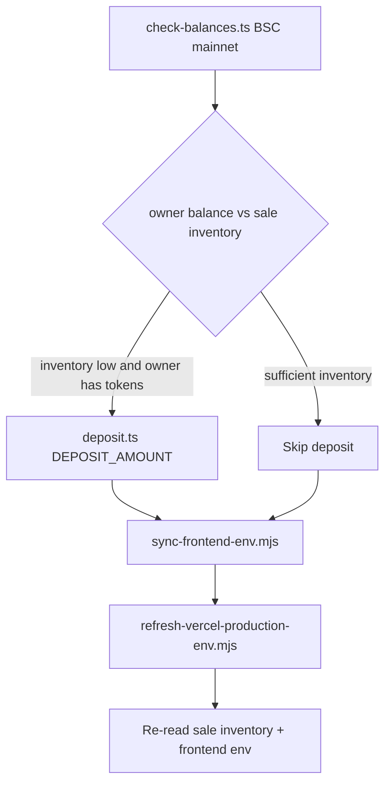

# USDT Sale Phase 2 — Hero, Header, Referral, Flags, SEO, On-chain Refresh, Deploy

## Контекст и решения

| Тема | Выбор |
|------|--------|
| Hero video | Копия из Downloads + оптimизация где возможно |
| Флаги | en→US, pt→BR, ar→SA |
| SEO keywords | Полный набор (flash, fake, trust wallet, phantom, BEP-20, BSC, BNB, tokens, coins) |
| Деплой | Production Vercel (`flash-tokens-trust-mainnet-20260528.vercel.app`) |
| **On-chain refresh** | **Только refresh** — без redeploy TokenSale (токен `0x11b4…8888` актуален) |
| Коммиты | **6 тематических** (+1 on-chain/env) |

**Mainnet reference** ([`.cursor/rules/flash-tokens-trust-workflow.mdc`](c:\Users\Asus\.cursor\flash-tokens-trust\.cursor\rules\flash-tokens-trust-workflow.mdc)):
- Owner: `0x4e8cEf391d4B1b06e1a643765cC7BbDef6F28953`
- Token: `0x11b4E3311112B6726327aa85AbB65c6802Da8888`
- Sale: `0x4E2d52456606D580A8e7414dFB99902B118C2957`

---

## 1. Hero video

**Файлы:** [`frontend/components/Hero.tsx`](frontend/components/Hero.tsx), `frontend/public/hero-loop.mp4`

- Скопировать `C:\Users\Asus\Downloads\document_6118323269843034499 (1).mp4` → `frontend/public/hero-loop.mp4`.
- Опционально ffmpeg: `-an -movflags +faststart -crf 28`; иначе as-is с `preload="metadata"`.

---

## 2. Mobile header only

**Файл:** [`frontend/components/Header.tsx`](frontend/components/Header.tsx) — только `max-md:` breakpoints.

- Grid layout на mobile: row1 menu+logo+title, row2 locale+wallet.
- LocaleSwitcher компактный trigger на mobile (флаг + код).
- Playwright: mobile viewport screenshot header.

---

## 3. Referral sign-once (приоритет)

**Файлы:** [`frontend/hooks/useReferralRegister.ts`](frontend/hooks/useReferralRegister.ts), [`frontend/lib/referral/consent.ts`](frontend/lib/referral/consent.ts), [`frontend/components/referral/ReferralDashboard.tsx`](frontend/components/referral/ReferralDashboard.tsx)

**GitNexus `impact` на `useReferralRegister` перед правкой.**

- Early exit по `hasReferralRegisteredFlag` / server `registered`.
- Stable deps (`onRegisteredRef`, без `signMessageAsync` в deps).
- Module mutex + sessionStorage proof (`referral-proof-v1:{wallet}`).
- Single mount через [`ReferralEffects.tsx`](frontend/components/referral/ReferralEffects.tsx) в [`HomeContent.tsx`](frontend/components/HomeContent.tsx).
- Unit tests: sign skipped when flag set; register retry without resign.

---

## 4. Locale flags + animation

**Файлы:** новые + [`frontend/components/LocaleSwitcher.tsx`](frontend/components/LocaleSwitcher.tsx)

- Mapping в `frontend/lib/i18n/locale-flags.ts`.
- Firecrawl → bundle SVG в `frontend/public/flags/{iso2}.svg`.
- `LocaleFlag` + CSS `@keyframes flagWave` + `prefers-reduced-motion: reduce`.

---

## 5. SEO + GEO + perf + cleanup

**Файлы:** [`frontend/app/layout.tsx`](frontend/app/layout.tsx), новый `frontend/app/[locale]/layout.tsx`, [`frontend/components/JsonLd.tsx`](frontend/components/JsonLd.tsx)

- @seo-geo: technical-seo → meta-tags → schema → geo-content.
- `html lang={locale}`, `dir="rtl"` для `ar`, hreflang для 13 locales.
- `memory/monitoring/2026-06-03-usdt-sale-alerts.md` (@alert-manager).
- Safe cleanup: `.next`, stale playwright output — **не трогать** `smart-contract/`, promo assets, `.env*`.

---

## 6. On-chain refresh (новая задача) — без ротации контракта

**Цель:** синхронизировать инвентарь sale с owner-кошельком и прокинуть актуальные адреса в frontend + Vercel production. **Redeploy TokenSale и `migrate-inventory.ts` не выполняем** — sale уже привязан к `0x11b4…8888`.

**Скрипты** ([`smart-contract/scripts/`](c:\Users\Asus\.cursor\flash-tokens-trust\smart-contract\scripts)):
- [`check-balances.ts`](c:\Users\Asus\.cursor\flash-tokens-trust\smart-contract\scripts\check-balances.ts) — owner + sale inventory для `TOKEN_ADDRESS=0x11b4…8888`.
- [`deposit.ts`](c:\Users\Asus\.cursor\flash-tokens-trust\smart-contract\scripts\deposit.ts) — `approve` + `depositTokens` в текущий sale из [`deployed-contract.json`](c:\Users\Asus\.cursor\flash-tokens-trust\smart-contract\deployed-contract.json).
- **Не вызывать:** `deploy.ts`, `migrate-inventory.ts` (только если token mismatch — в этой задаче исключено).

**Env pipeline** (корень репо):
1. `node scripts/sync-frontend-env.mjs` → `frontend/.env.local` из `deployed-contract.json`.
2. `node scripts/refresh-vercel-production-env.mjs` → Vercel production env (`VERCEL_TOKEN` в `frontend/.env.production.local`).

**Preconditions:**
- `smart-contract/.env` с `PRIVATE_KEY` owner и `TOKEN_ADDRESS=0x11b4E3311112B6726327aa85AbB65c6802Da8888`.
- Если owner balance недостаточен для deposit — **не падать весь pipeline**: зафиксировать в отчёте текущий inventory sale и продолжить env sync (как в [прошлой сессии](6c49603f-d384-4997-843b-fc2784271129) при `Insufficient token balance`).

**Deposit amount:** уточнить по результату `check-balances` (целевой top-up или фиксированный `DEPOSIT_AMOUNT` из env; по умолчанию не деплоить без явного surplus на owner).

**Deliverable:** краткий on-chain отчёт (owner balance, sale inventory, tx hash deposit если был) в финальной сводке + обновлённый [`AGENTS.md`](AGENTS.md).

---

## 7. QA, commits, deploy, memory

### Pre-commit

- `npx gitnexus analyze` (if stale) + `gitnexus_detect_changes()`
- `cd frontend && npm run lint && npm run test && npm run build`

### 6 commits

1. `feat(hero): replace hero-loop video from user asset`
2. `fix(header): mobile-only header layout without overlap`
3. `fix(referral): wallet proof sign-once with persisted consent`
4. `feat(i18n): locale flags with wave animation in switcher`
5. `feat(seo): hreflang metadata schema keywords and safe cleanup`
6. `chore(onchain): inventory refresh and production env sync` — только если меняются env-артефакты или добавлен runbook; **on-chain tx не коммитятся**, только docs/sync если нужно

### Deploy pipeline

- **On-chain refresh (п.6)** → затем frontend build
- **@deployment-expert** + Vercel MCP → production promote
- **Playwright CLI** → local then prod (mobile header, flags, referral)
- **@agents-memory-updater** → [`AGENTS.md`](AGENTS.md)

---

## Порядок выполнения

1. GitNexus impact → referral fix + tests  
2. Hero video copy  
3. Mobile header CSS  
4. Firecrawl flags → LocaleSwitcher  
5. SEO/GEO metadata + JsonLd + alert doc  
6. **On-chain check-balances → optional deposit → sync-frontend-env → refresh-vercel-production-env**  
7. Cleanup + perf pass  
8. lint/test/build → Playwright local  
9. 6 commits → Vercel prod → Playwright prod → AGENTS.md → финальная сводка

---

## Риски

| Risk | Mitigation |
|------|------------|
| Owner без токенов для deposit | Skip deposit, document inventory, still sync env |
| Trust Wallet sign loop | sessionStorage + server registered |
| ffmpeg missing | copy as-is |
| Wrong token redeploy | **Out of scope** — refresh-only per user choice |
