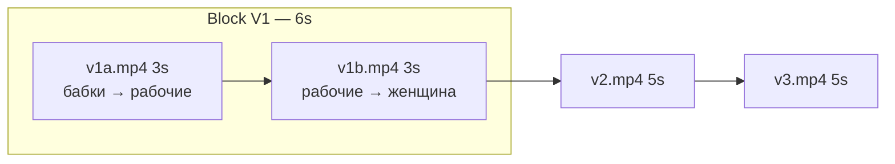

# V1: два клипа по 3 сек + кадр «работяги»

## Новая структура таймлайна (16 сек)



| Клип | Длина | Start frame | Last frame | Экспорт |
|------|-------|-------------|------------|---------|
| **V1a** | 3 s | бабки (уже есть) | **работяги (новый)** | `production/video/v1a.mp4` |
| **V1b** | 3 s | работяги (тот же) | женщина с чемоданом (уже есть) | `production/video/v1b.mp4` |

**Ваши 2 картинки** (из Cursor assets) маппятся так:
- [Generated_image_3](file:///C:/Users/Asus/.cursor/projects/c-Users-Asus-cursor-InCruises/assets/c__Users_Asus_AppData_Roaming_Cursor_User_workspaceStorage_39690f96c118ac4060558e148240abac_images_Generated_image_3-f057ed99-b543-498f-b16e-b09311f9acc5.png) → `production/frames/v1a_start.png` (бабки + площадь)
- [Generated_image_4](file:///C:/Users/Asus/.cursor/projects/c-Users-Asus-cursor-InCruises/assets/c__Users_Asus_AppData_Roaming_Cursor_User_workspaceStorage_39690f96c118ac4060558e148240abac_images_Generated_image_4-8d696d1e-2fe9-45a9-91ff-305102fa4dfe.png) → `production/frames/v1b_last.png` (женщина + смех бабок)

**Новый кадр:** `production/frames/v1_workers.png` — общий last для V1a и start для V1b.

> **Weavy/Kling:** если в UI только 5 s — рендерить 5 s и **обрезать до 3 s** в CapCut/DaVinci или через ffmpeg (`-t 3`). В промптах явно писать «3 second clip».

---

## 1. Nano Banana: кадр «работяги»

**Файл промпта:** [`production/prompts/v1_nano_workers.txt`](production/prompts/v1_nano_workers.txt) (новый)

**Attach:** референс `v1a_start.png` (ваша картинка с бабками) — **высокий вес**, чтобы сохранить площадь, Primaria, кобbles, backlight, палитру.

**Текст промпта (черновик для файла):**

```
Pixar Disney soft stylized 3D, vertical 9:16. SAME Moldovan town square as reference image — same cobblestone, city hall columns and warm backlight, cold desaturated greys and browns, slight fog. Camera has pushed past the two shouting grandmothers (only soft blur at bottom edge, not hero). HERO midground: skeptical working-class Moldovan men in flat caps, quilted jackets, arms crossed or shaking heads, mouths open arguing disapproval. Background: dense angry crowd silhouettes, children peeking between adults. Medium shot, eye level, 35mm, expressive caricature faces, subsurface skin, cinematic depth of field. Bridge frame between grandmothers scene and stressed woman with suitcase — no suitcase in frame.
```

**Negative (Nano):** `photoreal, anime, 2D, woman with suitcase, empty street, happy colors, cruise ship, kitchen, text watermark, deformed hands`

**Сохранить как:** `production/frames/v1_workers.png`

---

## 2. Kling V1a — бабки → рабочие (3 s)

| Поле | Файл |
|------|------|
| First | `frames/v1a_start.png` |
| Last | `frames/v1_workers.png` |
| Motion | `prompts/v1a_kling_motion.txt` |
| Negative | `prompts/v1a_kling_negative.txt` |
| Export | `video/v1a.mp4` |

**Motion prompt:**

```
3 second stylized 3D angry crowd fly-through, vertical 9:16. Start medium-wide on two shouting grandmothers in headscarves foreground, mouths open, fists raised. Camera glides forward 1.5 meters, slight arc right, rack focus from babki to midground working men in flat caps and jackets — arms crossed, shaking heads, shouting disapproval. Readable lip sync on both groups, handheld micro-shake, motion blur. End locked on workers group as hero mid-shot matching last frame. Same cold dusk palette and city hall backlight as start.
```

**Negative prompt:**

```
photoreal, live action, 2D, anime, woman with suitcase, solo portrait, empty street, static camera, morphing faces, extra fingers, bright happy colors, cruise ship, kitchen, text overlay, peaceful crowd
```

---

## 3. Kling V1b — рабочие → женщина (3 s)

| Поле | Файл |
|------|------|
| First | `frames/v1_workers.png` |
| Last | `frames/v1b_last.png` |
| Motion | `prompts/v1b_kling_motion.txt` |
| Negative | `prompts/v1b_kling_negative.txt` |
| Export | `video/v1b.mp4` |

**Motion prompt:**

```
3 second continuous stylized 3D crowd push, vertical 9:16. Start on working men midground matching first frame. Camera glides forward through grey faceless mass chanting, workers blur to edges. Rack focus to close-medium skeptical middle-aged woman with rolling suitcase and neck pillow badge — dismissive pointing gesture, mouth shouting. Background grandmothers soft blur left, crowd mouths opening into laughter at end. Handheld shake, cinematic motion blur, cold rim light. Match last frame composition exactly.
```

**Negative prompt:**

```
photoreal, live action, 2D, anime, sharp foreground grandmothers, empty street, static camera, morphing faces, deformed teeth, bright happy colors, cruise ship, kitchen, kitchen interior, text watermark, lifeboat
```

---

## 4. Озвучка V1 — переразложение на 3+3

Тексты **без изменений**; сдвигаются только старты внутри блока V1 (0–6 s в финале):

| Время (глоб.) | Локально | WAV | Текст |
|---------------|----------|-----|-------|
| 0.00 | V1a 0.00 | `v1_grannies.wav` | «Разводилово — обман!» |
| 1.20 | V1a 1.20 | `v1_family.wav` | «Тоже что TUX!» *(на работягах)* |
| 3.00 | V1b 0.00 | `v1_crowd.wav` | «Фуу, пирамида!» |
| 4.00 | V1b 1.00 | `v1_woman.wav` | «Круизы? Дорого, бред!» |
| 5.20 | V1b 2.20 | `v1_laugh.wav` | смех |

V2 с **6.00 s**, V3 с **11.00 s**.

Обновить: [`production/scripts/assemble_final.py`](production/scripts/assemble_final.py) — 4 клипа, `total_sec=16`, `-t 3` для v1a/v1b в `normalize_clip`.

---

## 5. Файлы и доки для правки

| Действие | Файлы |
|----------|--------|
| Новые промпты | `v1_nano_workers.txt`, `v1a_kling_motion.txt`, `v1a_kling_negative.txt`, `v1b_kling_motion.txt`, `v1b_kling_negative.txt` |
| Устаревшие (архив/пометка) | `v1_kling_motion.txt`, `v1_kling_negative.txt`, `v1_nano_last.txt` — last теперь `v1b_last`; start split на `v1a_start` |
| Копирование картинок | assets → `frames/v1a_start.png`, `frames/v1b_last.png` |
| Workflow JSON | [`production/weavy_workflow.json`](production/weavy_workflow.json) — `v1` → `v1a` + `v1b` |
| План | [`incruises_15s_video_plan.md`](incruises_15s_video_plan.md) → секция V1 + «16 сек финал» |
| README | [`production/README.md`](production/README.md) — слоты `v1a.mp4`, `v1b.mp4` |
| Плейсхолдер-клипы | [`production/scripts/generate_clips.py`](production/scripts/generate_clips.py) — пары v1a, v1b с `DUR=3` |

---

## 6. Порядок работы для вас в Weavy

1. Скопировать **image 3** → `v1a_start.png`, **image 4** → `v1b_last.png`.
2. **Nano Banana 2** + attach `v1a_start` → сгенерировать `v1_workers.png` (промпт выше).
3. **Kling 3.0 Pro** V1a: start/last + motion/negative V1a → export → trim 3 s → `v1a.mp4`.
4. **Kling 3.0 Pro** V1b: `v1_workers` / `v1b_last` + motion/negative V1b → `v1b.mp4`.
5. Монтаж: `v1a` + `v1b` hard cut → V2 hard cut → V3; WAV по новой таблице.
6. Финал: `production/output/incruises_16s_9x16.mp4` (или переименовать старый слот).

**Element для V1:** по-прежнему не использовать.
