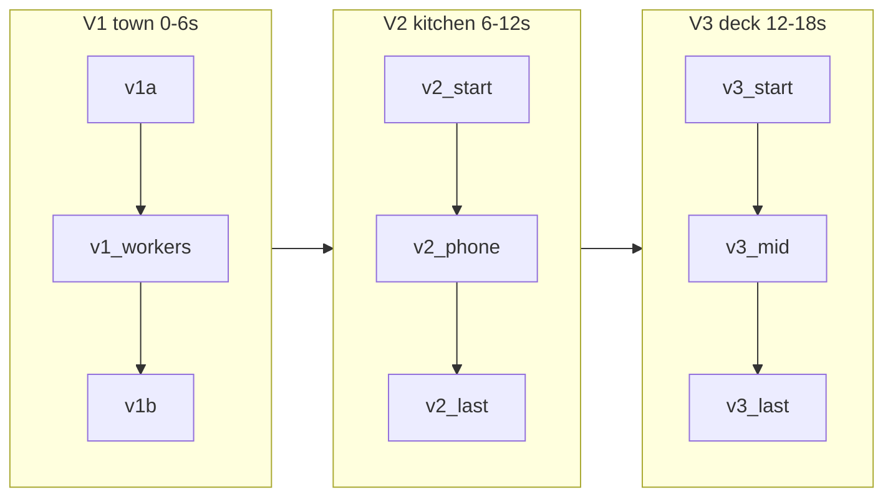

# Split V2/V3 на 3+3 с мостовыми кадрами (18 s)

## Итоговая структура



| Клип | Start frame | Last frame | Global time |
|------|-------------|------------|-------------|
| v1a | `v1a_start.png` | `v1_workers.png` | 0–3 s |
| v1b | `v1_workers.png` | `v1b_last.png` | 3–6 s |
| **v2a** | `v2_start.png` | **`v2_phone.png`** | 6–9 s |
| **v2b** | **`v2_phone.png`** | `v2_last.png` | 9–12 s |
| **v3a** | `v3_start.png` | **`v3_mid_deck.png`** | 12–15 s |
| **v3b** | **`v3_mid_deck.png`** | `v3_last.png` | 15–18 s |

V1 без изменений. [`assemble_final.py`](production/scripts/assemble_final.py): `TOTAL_SEC = 18`, `CLIP_ORDER` — 6×3 s, offsets `V2A=6`, `V2B=9`, `V3A=12`, `V3B=15`.

---

## 1. Мостовой кадр V2 — `v2_phone.png`

**Роль:** конец v2a = начало v2b. Между «диалог у угла» ([`v2_start.png`](production/frames/v2_start.png)) и «телефон — герой кадра» ([`v2_last.png`](production/frames/v3_last.png) → actually v2_last).

**Композиция (продуманная):**
- Та же кухня 19:00, те же Element-лица.
- Камера чуть ближе, чем в start: medium waist-up, оба лица ~35% высоты кадра.
- **Анжела:** жест «устала от перелётов» уже затихает, слушает, брови приподняты.
- **Саша:** поднимает смартфон на уровень груди, экран уже виден (InCruises: navy/orange, но UI ещё не доминирует кадр — ~25% нижней трети).
- Нет hero push-in как в last; руки без деформаций, warm LED снизу.

**Nano:** новый [`production/prompts/v2_nano_phone.txt`](production/prompts/v2_nano_phone.txt)  
- Attach: `v2_start.png` (high — кухня/пара/свет) + asset C (низкий — только палитра UI на экране).  
- Output: `production/frames/v2_phone.png`  
- Weavy: отдельная нода Nano Banana (как [`v1_nano_workers.txt`](production/prompts/v1_nano_workers.txt)).

---

## 2. Мостовой кадр V3 — `v3_mid_deck.png`

**Роль:** после первого обмена реплик на палубе, до финального «premium / подруги за».

**Композиция:**
- Та же палуба и sunset mood (F), те же круизные образы Element.
- Пара у перил, **повернулись друг к другу** (не в камеру): Sasha с лёгкой улыбкой, жест «круто же»; Angela кивает, шаль/волосы от ветра.
- Небо: оранжево-розовое, ещё не blue-violet как в [`v3_last.png`](production/frames/v3_last.png).
- Огни бассейна/гирлянды в bokeh; medium close, лица ~40%, без wide ship-only shot.

**Nano:** новый [`production/prompts/v3_nano_mid_deck.txt`](production/prompts/v3_nano_mid_deck.txt)  
- Attach: `v3_start.png` (high) + A (faces) + F (mood, low).  
- Output: `production/frames/v3_mid_deck.png`

---

## 3. Kling: 4 новых клипа (по образцу V1a/V1b)

Каждый файл motion + negative **≤2500 символов**, с **таймкодами**, **русскими репликами в motion**, anti-storyboard в negative.

### V2a (`v2_start` → `v2_phone`, 3 s)
- **0.0–1.7** Angela lip sync: «Надоели перелёты и отели… хочу новое!»
- **1.7–3.0** Sasha отвечает, тянется к телефону; dolly чуть вперёд; lock на bridge.
- Element: `element_v2_faces` + `element_v2_bodies_home` (оба клипа V2).
- Файлы: `v2a_kling_motion.txt`, `v2a_kling_negative.txt` → `video/v2a.mp4`

### V2b (`v2_phone` → `v2_last`, 3 s)
- **0.0–1.5** Sasha: «Давай круиз! Смотри — InCruises, друг советовал.» — pan down на UI.
- **1.5–3.0** Angela: «Ну, посмотрим…» — наклон к экрану.
- Файлы: `v2b_kling_motion.txt`, `v2b_kling_negative.txt` → `video/v2b.mp4`

### V3a (`v3_start` → `v3_mid_deck`, 3 s)
- **0.0–1.5** Sasha: «Рад, что мы in InCruises — круто!»
- **1.5–3.0** Angela: «Волшебно! Отели не сравнятся.» — поворот друг к другу, ветер.
- Element: `element_v3_faces` + `element_v3_bodies_cruise`.
- Файлы: `v3a_kling_motion.txt`, `v3a_kling_negative.txt` → `video/v3a.mp4`

### V3b (`v3_mid_deck` → `v3_last`, 3 s)
- **0.0–1.4** Sasha: «Premium выгодно — друзья тоже хотят!»
- **1.4–3.0** Angela: «Подруги за!» + лёгкий laugh; sky темнеет к last frame.
- Файлы: `v3b_kling_motion.txt`, `v3b_kling_negative.txt` → `video/v3b.mp4`

**Deprecated** (заголовок в файле): [`v2_kling_motion.txt`](production/prompts/v2_kling_motion.txt), [`v2_kling_negative.txt`](production/prompts/v2_kling_negative.txt), [`v3_kling_motion.txt`](production/prompts/v3_kling_motion.txt), [`v3_kling_negative.txt`](production/prompts/v3_kling_negative.txt).

---

## 4. Озвучка — global WAV offsets (18 s)

V1 без изменений. V2/V3 сдвигаются на +1 s из‑за удлинения блока V2 (5→6 s):

| WAV | Global start | Клип (local) |
|-----|--------------|--------------|
| v2_angela_a | **6.0** | v2a 0.0 |
| v2_sasha | **7.7** | v2a 1.7 |
| v2_angela_b | **10.0** | v2b 1.0 *(было 9.1 — под вторую половину)* |
| v3_sasha_a | **12.0** | v3a 0.0 |
| v3_angela | **13.5** | v3a 1.5 |
| v3_sasha_b | **15.0** | v3b 0.0 |
| v3_angela_b | **16.4** | v3b 1.4 |

Обновить: [`assemble_final.py`](production/scripts/assemble_final.py), [`weavy_workflow.json`](production/weavy_workflow.json) (`audio_timeline`), при необходимости комментарии в [`generate_audio.py`](production/scripts/generate_audio.py) / README.

---

## 5. Скрипты и прокси-клипы

[`generate_clips.py`](production/scripts/generate_clips.py) — заменить пары v2/v3 на:

```python
("v2a", "v2_start.png", "v2_phone.png", 3.0),
("v2b", "v2_phone.png", "v2_last.png", 3.0),
("v3a", "v3_start.png", "v3_mid_deck.png", 3.0),
("v3b", "v3_mid_deck.png", "v3_last.png", 3.0),
```

Пока `v2_phone.png` / `v3_mid_deck.png` нет — скрипт может копировать placeholder из `v2_start`/`v3_start` с WARN (как для v1_workers) или ждать Nano.

[`assemble_final.py`](production/scripts/assemble_final.py): export → `incruises_18s_9x16.mp4` (или сохранить старое имя + комментарий в README).

---

## 6. Документация и Weavy

- [`incruises_15s_video_plan.md`](incruises_15s_video_plan.md): секции 5–6 → split 3+3, таблицы frames/Kling/диалог, сводка «куда что в Weavy», таймлайн **18 s**.
- [`production/README.md`](production/README.md): 6 клипов, лимит 2500, порядок Weavy для v2a/v2b/v3a/v3b.
- [`production/weavy_workflow.json`](production/weavy_workflow.json): `duration_total: 18`, nodes `v2a`/`v2b`/`v3a`/`v3b` (nano bridge + kling start/last/motion/negative/element), удалить single `v2`/`v3` exports.

---

## 7. Порядок работ в Weavy (ручные шаги после merge)

1. Nano → `v2_phone.png` (attach `v2_start` + C).
2. Nano → `v3_mid_deck.png` (attach `v3_start` + A + F).
3. Kling 3.0 Pro ×4: v2a, v2b, v3a, v3b (trim до 3 s при необходимости).
4. Положить MP4 в `production/video/`, запустить `python production/scripts/assemble_final.py`.

---

## Риски

- **Двойной звук:** если Kling экспортирует с baked dialogue — в монтаже отключить встроенную дорожку или не дублировать те же реплики в `amix`.
- **Bridge mismatch:** если last v2a ≠ start v2b в Weavy — перегенерировать Nano с большим весом `v2_start` или подправить motion «lock last frame».
- **2500 limit:** negative для v2b/v3b с русскими anti-VO блоками сжимать как в [`v1b_kling_negative.txt`](production/prompts/v1b_kling_negative.txt).
