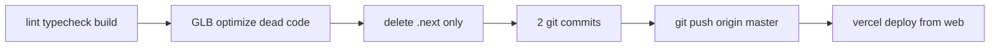

# Финализация: проверка, очистка, коммит, push, Vercel

## Текущее состояние

Правки из [плана NEOCAR](c:\Users\Asus\.cursor\plans\neocar_site_updates_fa3c748f.plan.md) **уже в рабочей копии**, сборка ранее проходила (`next build` OK). Не закоммичено:

| Категория | Файлы |
|-----------|--------|
| Код (18) | `web/components/**`, `web/content/**`, `web/messages/*`, `web/lib/seo.ts`, `web/app/**` |
| Новое | [`web/lib/social-links.ts`](web/lib/social-links.ts) |
| Ассет | `web/public/models/Meshy_AI_Toyota_Forklift_0523121640_texture.glb` (~37 MB, **untracked**) |
| Служебное | `web/next-env.d.ts` (путь `./.next/types/routes.d.ts` — норма для Next 16 после build) |
| **Не коммитить** | `.cursor/` (правила IDE) |

Удалённые ссылки (`phoneOffice`, `info@neocar`, глобус) в `web/` **не найдены** — реализация согласована.

Remote: `origin` → `https://github.com/ArtyCry12/neocar-site-main.git`, ветка `master`.



---

## 1. Полная проверка (read-only → fix only if fails)

В каталоге [`web/`](web/):

```powershell
cd web
npm run lint
npm run typecheck
npm run build
```

При ошибках — точечные правки (типы, неиспользуемые импорты, i18n-ключи).

**Ручной чеклист UI** (после `npm run dev` или preview):

- Hero: нет дубля логотипа; слайды ~6 с; desktop — новый GLB; mobile — видео без изменений
- Header: логотип по центру X
- Value: нет «Обычно / У нас»; текст «Опыт» обновлён
- Catalog: 7 карточек, «Экскаваторы» по центру (`lg:col-start-2`)
- Контакты: карта сразу; Facebook/TikTok; нет `info@` и `+373 22 479 545`; у Марина — `marin@neocar.md`

Опционально: `npm run e2e` — только если Playwright уже настроен и не блокирует по GLB/env.

---

## 2. Доводка до «идеала» (минимальный diff)

### 2.1 Оптимизация GLB (критично для Vercel/LCP)

Сейчас desktop грузит **37 MB** raw Meshy-файл. В репо уже есть pipeline [`web/scripts/optimize-glb.mjs`](web/scripts/optimize-glb.mjs) (gltf-transform → `forklift.opt.glb`).

**Действие:** расширить скрипт (или одноразовая команда) для входа `Meshy_AI_Toyota_Forklift_0523121640_texture.glb` → выход, например:

`web/public/models/Meshy_AI_Toyota_Forklift_0523121640_texture.opt.glb`

Затем в [`HeroCanvas.tsx`](web/components/hero/HeroCanvas.tsx), [`HeroMiniCanvas.tsx`](web/components/hero/HeroMiniCanvas.tsx), [`layout.tsx`](web/app/layout.tsx) preload — URL на **`.opt.glb`**, исходник 37 MB **не коммитить** (добавить в [`.gitignore`](.gitignore) строку `web/public/models/Meshy_AI_Toyota_Forklift_0523121640_texture.glb` как raw source, по аналогии с `forklift-source.glb`).

Если optimize даст слишком агрессивное сжатие — подкрутить `--texture-size` (512 → 1024) и при необходимости `DESKTOP_HERO_MODEL_TARGET` в `HeroCanvas.tsx`.

### 2.2 Мёртвый код (безопасно)

- [`web/components/ui/globe.tsx`](web/components/ui/globe.tsx) — **нигде не импортируется** после рефактора `neocar-location`; удалить файл.
- Неиспользуемые ключи `Why.v1Typical` … `Why.v3Us` в `messages/*.ts` — опционально удалить (уменьшение шума, не обязательно).

### 2.3 Не трогать

- `design/` (эталоны)
- `web/public/models/forklift*.glb` уже в git (mobile/legacy)
- `web/public/media/**`, `node_modules/`, `.cursor/`
- Lighthouse JSON в `web/` — не build-кэш; не удалять без явного запроса

---

## 3. Очистка **только** ненужного кэша

| Удалить | Почему безопасно |
|---------|------------------|
| `web/.next/` (~350+ MB) | В [.gitignore](.gitignore), пересобирается `next build` |
| `web/playwright-report/`, `web/test-results/` | Если есть — артефакты тестов, в gitignore |

**Не удалять:** `node_modules/`, `web/public/**`, `.vercel/` (локальная привязка проекта), tracked models.

---

## 4. Git: пошаговые коммиты

**Не включать:** `.cursor/`, raw 37 MB GLB (если есть optimized), `.env*`

### Commit 1 — функциональные правки сайта

```
feat(web): hero, catalog, contacts and value section updates

- Remove hero logo overlay; carousel 6s; desktop Meshy forklift GLB
- Center header logo; drop Why comparison row; update Experience copy
- Reorganize catalog cards; replace office phone with Facebook/TikTok
- Remove info@neocar.md; add marin@neocar.md; show map without globe
```

Файлы: все modified TS/TSX + `social-links.ts` + `messages/*` + `next-env.d.ts`.

### Commit 2 — оптимизированный 3D-ассет

```
chore(web): add optimized desktop hero forklift model
```

Файлы: `Meshy_*_texture.opt.glb` + `.gitignore` (raw exclude) + правки URL preload при необходимости.

Если optimize не успеет — один коммит с пометкой в body про размер ассета (хуже для deploy, fallback).

---

## 5. Push на GitHub

```powershell
git push -u origin master
```

Требуются сетевые права. При отказе по размеру файла (>100 MB) — убедиться, что в push только `.opt.glb`, не raw.

---

## 6. Деплой Vercel (auto)

Корень приложения: **`web/`** ([`web/vercel.json`](web/vercel.json), `framework: nextjs`).

```powershell
cd web
npx.cmd vercel link    # если ещё не привязан — выбрать существующий проект neocar
npx.cmd vercel status  # проверить linked project
npx.cmd vercel deploy --prod   # или preview, если status покажет, что prod = main
```

- Если `master` уже подключён к **Production** в dashboard — `--prod` после push может сработать и автодеплой; CLI — для явного контроля.
- Проверить в dashboard: Root Directory = `web`, что новый GLB попал в deployment assets.
- После деплоя: открыть production/preview URL, smoke по чеклисту из §1.

---

## Риски

| Риск | Митигация |
|------|-----------|
| 37 MB GLB в git/deploy | optimize → `.opt.glb`, raw в gitignore |
| `next-env.d.ts` меняется локально | коммитить только после `build`; не править вручную |
| Vercel не linked | `vercel link` + env из dashboard |
| Push rejected (large file) | Git LFS не нужен, если только opt < ~10–15 MB |

---

## Критерий готовности

- `lint` + `typecheck` + `build` — green
- 2 коммита на `master`, push успешен
- Vercel deployment Ready, сайт на проде/preview соответствует ТЗ
- В репозитории нет `info@neocar.md`, `+373 22 479 545`, глобуса
