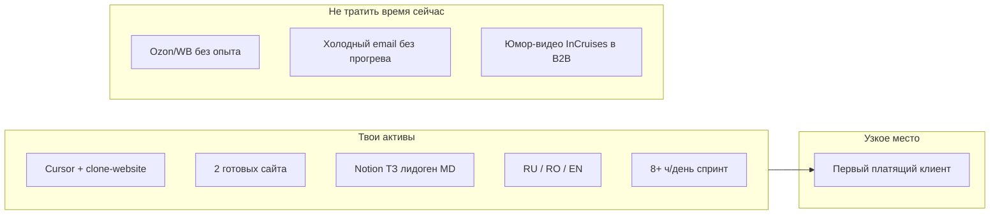
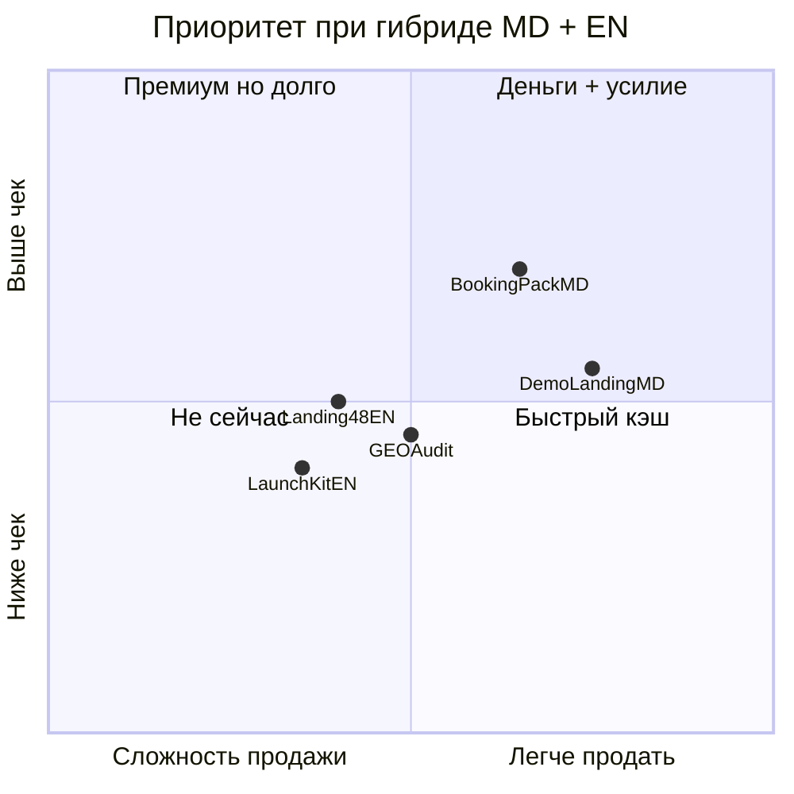
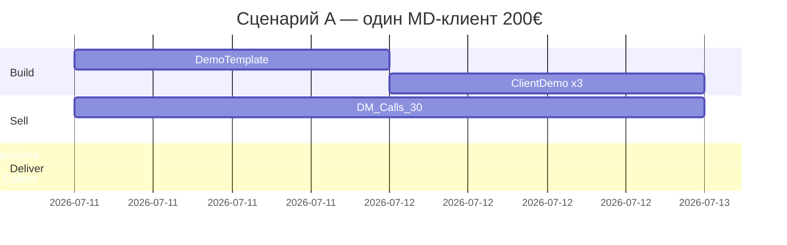

# Быстрые $100–300: персональный план

## Твой профиль (что реально работает на тебя)

| Фактор | Вывод |
|--------|--------|
| Гео | MD: лендинг [50–200€](https://moldovawebsite.md/preturi/) — дешёвый рынок, 1 клиент = цель. EN-глобал: [48land $150](https://www.48land.com/) — тот же продукт, другая валюта |
| Скорость | 12–16ч лендинг + 3ч правки — **конкурентное преимущество**, не эксклюзив |
| Портфолио | 2 сайта (друг + предприниматель) — **достаточно** для первой сделки. Третий «сомнительный» и InCruises — **не в коммерческий питч** |
| Бюджет ≤$5 | Vercel/Netlify free + свой домен позже = **$0–4** на старт |

**Жёсткая правда:** $100–300 за 3–5 дней — это **1–2 сделки**, не «пассив». Твоё [ТЗ лидоген-системы](https://app.notion.com/p/3976689eb5b88094a77dcb7c6e31e9c4) само говорит: email-рассылка = **1–2 недели прогрева**. Значит **быстрые деньги = Instagram/WhatsApp/звонок/DM**, не inbox.

---

## Топ-5 (персонально, не «10 идей из Google»)

### 1. «Сайт до оплаты» для MD-бизнеса без сайта — **главный став**

**Суть:** Не продаёшь «разработку». Продаёшь **готовую страницу с их названием/услугами/телефоном**, собранную за ночь по открытым данным (Google Maps, Instagram).

**Ниша MD (приоритет):** стоматологии, салоны, клиники, автосервисы — из твоего же ТЗ.

**Цена / срок**
- **150–250€** (или **$170–280**) за лендинг + 1 круг правок
- Сборка: **1–1.5 дня** | правки клиента: **0.5 дня** | outreach параллельно

**План 5 дней**
| День | Действие |
|------|----------|
| 1 | 1 шаблон-скелет (clone-website) + 3 **демо** под разные ниши |
| 2–3 | 30–50 DM/звонков: «Вот черновик под вас, не шаблон с Avito» |
| 4 | Бриф + 50% предоплата → финал |
| 5 | Деплой + остаток |

**Почему тебе:** уже есть логика [системы поиска клиентов MD](https://app.notion.com/p/3976689eb5b88094a77dcb7c6e31e9c4) + 2 кейса + RU/RO.

**Риски:** ghosting после демо (копируют и уходят); низкий чек в MD. **Митigation:** watermark на демо, **50% до снятия watermark и деплоя**, не отдавать исходники.

---

### 2. Productized «48h Landing» на EN — гибрид MD + глобал

**Суть:** Один оффер, одна страница, один прайс — как [48hr.dev](https://48hr.dev/) / [48land](https://www.48land.com/), но ты человек + Cursor.

**Оффер:** «Conversion landing in 48h — $149–199 — hosting ready — 1 revision included»

**Где продавать (быстро):**
- X: ответы на «need landing page», «launching this week»
- Upwork: fixed-price $150, **не hourly**
- Kwork / Contra: готовый gig с 2 скринами твоих сайтов

**Математика:** 1×$199 или 2×$120 = цель. При 8ч/день — **1 клиент реалистичнее 2**.

**Риски:** EN-конкуренция, нулевые отзывы на площадке. **Митigation:** первому клиенту **$129** в обмен на testimonial + скрин метрик.

---

### 3. «AI-видимость за 24ч» — микро-GEO без глубокого SEO

**Тренд июля 2026:** Search Everywhere + AI citation ([b2the7, 6 июл](https://www.b2the7.com/news-blog/marketing-trends-july-2026-geo-agentic-ads-tiktok-shop)) — бизнесы боятся «ChatGPT нас не видит».

**Продукт (не ретainer):**
- Проверка GPTBot/ClaudeBot/PerplexityBot в robots.txt
- `llms.txt` + мини-отчёт (5 тест-запросов)
- 3 конкретных фикса

**Цена:** **$99–149** ([Optimum Web](https://www.optimum-web.com/seo-aeo-geo/audit/ai-visibility-audit/), [TapasSEO $150](https://tapasseo.com/llms-txt-config/))

**Кому:** MD-компании **с сайтом** (другой сегмент, чем идея №1) + EN micro-SaaS/indie на X.

**Время:** 2–4ч на аудит с Cursor-скриптом/чеклистом. **2 клиента = $200–300.**

**Риски:** клиент не понимает ценность. **Митigation:** показать скрин «ваш конкурент в Perplexity — вы нет».

**Граница:** не лезть в 20-keyword SEO, рекламу, контент-план — только пакет «24h AI visibility fix».

---

### 4. «Запись + лендинг» для салонов/клиник MD

**Тренд:** TikTok = поиск + локальные услуги ([Semark 2026](https://semarkglobal.com/blog/tiktok-marketing-small-business-2026)); WhatsApp/Instagram DM как CRM.

**Пакет «Под ключ за 3 дня»:**
- Лендинг (из №1)
- Кнопки WhatsApp/Telegram + простая форма
- QR для Instagram bio
- *(опционально)* Google Business — только если клиент даст доступ

**Цена:** **200–300€** — выше чистого лендинга, потому что «теряете заявки в Direct».

**Почему быстро:** не CRM, не n8n-монстр — **forms + deep links**. Автomation — upsell потом.

**Риски:** клиент не отвечает в Direct после запуска → винит сайт. **Митigation:** в договоре: «конверсия зависит от скорости ответа в мессенджере».

---

### 5. «Launch Kit» для indie/микро-SaaS — 1 день, EN

**Тренд X/IG:** devs тонут в «написать landing + thread» ([Shipmate / DoraHacks](https://dorahacks.io/buidl/43271)).

**Продукт за $120–180:**
- Landing из GitHub README / Notion / 15-мин созвона
- Короткий X-thread (5 твитов) + тексты для Product Hunt comment
- Деплой на Vercel

**Кому:** solo founders в AI/tools, **не** enterprise.

**Почему тебе:** Cursor уже «читает репо и собирает»; твой production-видео можно использовать **только** если клиент просит promo — не в основной оффер.

**Риски:** scope creep («добавь auth»). **Митigation:** жёсткий scope: **1 страница, 1 revision, no backend**.

---

## Сравнение (куда бить первым)

**Рекомендуемый порядок при 8ч/день:** №1 + №4 параллельно (MD утро — outreach, вечер — EN gig №2/№5).

---

## Предоплата: правила (чтобы не сгореть)

| Правило | Зачем |
|---------|--------|
| **50% до старта финала**, 50% до передачи домена/репо | защита от «бесплатного дизайнера» |
| Scope в 10 строках в Telegram/Notion | 1 revision included, дальше **$30/ч или фикс пакет** |
| Демо с watermark / без исходников | anti-copy |
| Нет оплаты 48ч → стоп, демо остаётся у тебя | не дорабатывать «на веру» |
| MD: наличные/перевод/MAIB; EN: Wise/PayPal/Upwork escrow | без escrow — только предоплата |

---

## Отдельно: идея с другим графиком выплат

**Мини-курс «Cursor за 3 вечера» + Telegram-чат** (из [Notion «Курс по Ии»](https://app.notion.com/p/3986689eb5b880efbd0fe11a878cbf68))

- **$15–30 × 10–15 человек = $150–450**, но цикл **7–14 дней** (набор, не «3 дня»)
- Плюс: рефералки Cursor/агрегаторов = снижение cost разработки, не cash now
- Минус: поддержка группы съедает спринт
- **Вердикт:** отложить до первых $300 с №1–2, иначе распыление

---

## Что не так с запросом (честно)

1. **Путаешь время сборки и время сделки.** 16ч лендинг ≠ 16ч до денег. Заложи **60% времени на продажи**.
2. **$100–300 и «серые зоны»** — scraping/DM без opt-out = репутация + ToS. Для MD локала хватит **белого** show-before-sell.
3. **Не указал:** язык клиента по умолчанию, способ приёма оплаты, готовность к **звонкам** (в MD звонок конвертит лучше DM).
4. **InCruises-контент** — убить из B2B-питча; production video — только по запросу.
5. **MELO сайт пуст** — для быстрых денег нужна **одна** страница-витрина с 2 кейсами + Calendly/Telegram (4–6ч, окупается).

---

## Реалистичный сценарий «+$200 за 5 дней»

**Plan B (если MD молчит к дню 3):** включить EN gig №2 на Upwork + 5 X-replies/день.

---

## Источники / бенчмарки

- MD цены: [moldovawebsite.md](https://moldovawebsite.md/preturi/), [dits.md](https://dits.md/en/website-development/)
- Global 48h: [48land.com](https://www.48land.com/), [48hr.dev](https://48hr.dev/)
- GEO микро-услуги: [Optimum Web $99 audit](https://www.optimum-web.com/seo-aeo-geo/audit/ai-visibility-audit/), [TapasSEO llms.txt $150](https://tapasseo.com/llms-txt-config/)
- Тренды июль 2026: [GEO + TikTok Shop](https://www.b2the7.com/news-blog/marketing-trends-july-2026-geo-agentic-ads-tiktok-shop), [TikTok SMB](https://semarkglobal.com/blog/tiktok-marketing-small-business-2026)
- Micro-freelance чеки: [$75–150/задача](https://thetopworldnews.com/realistic-extra-income-micro-freelancing/)

---

## Следующий шаг после approve плана

1. Выбрать **один** основной оффер (рекомендация: №1 «сайт до оплаты» MD).
2. Собрать **одностраничную витрину** с 2 кейсами (не ждать MELO).
3. Подготовить **скрипт DM/звонка** на RU/RO (3 предложения + ссылка на демо).
4. Параллельно опубликовать **EN gig $149** с фикс scope.
